# BloomTech — Smart Agriculture Nursery Management

> "From a single pot to a full field — BloomTech grows with you."

A Flutter mobile application for automated plant nursery management, developed as a graduation project for the Faculty of Computer Science & Artificial Intelligence, Pharos University in Alexandria (2025). The app provides a real-time interface to a sensor-driven monitoring/irrigation system, an AI-assisted leaf disease scanning workflow, and an in-app agricultural services marketplace.

**Scope note:** The core of this repository is the **Flutter mobile application** (`lib/`). It also includes reference implementations for the two other subsystems the thesis describes — Arduino/ESP32 firmware (`hardware/`) and a Flask disease-diagnosis server (`backend/`) — written to match the exact interfaces the app already expects. **Neither has been tested against real hardware or a trained model**; see their own READMEs and [Documentation vs. Implementation Notes](#documentation-vs-implementation-notes) for exactly what is and isn't verified.

---

## Table of Contents

- [Overview](#overview)
- [Problem Statement](#problem-statement)
- [Objectives](#objectives)
- [Key Features](#key-features)
- [System Architecture](#system-architecture)
- [Hardware Components](#hardware-components-documented)
- [Software Technologies](#software-technologies)
- [Project Structure](#project-structure)
- [Installation](#installation)
- [Configuration](#configuration)
- [Running the Project](#running-the-project)
- [AI / Disease Detection](#ai--disease-detection)
- [Firebase Usage](#firebase-usage)
- [Testing](#testing)
- [Documentation vs. Implementation Notes](#documentation-vs-implementation-notes)
- [Screenshots](#screenshots)
- [Future Improvements](#future-improvements)
- [Contributors](#contributors)
- [License](#license)

---

## Overview

Traditional nursery management relies on manual monitoring, which is slow to react to changing soil, light, and moisture conditions and inconsistent at spotting early plant disease. BloomTech pairs a Firebase-backed mobile app with an IoT sensor/actuator system to give nursery owners live environmental data, automated irrigation and pH correction, and a camera-based disease-scanning workflow, alongside a built-in marketplace for renting tools, hiring farmers, and buying seeds.

## Problem Statement

Many plant nurseries lack real-time, integrated monitoring and automated response to environmental changes. Manual observation delays the detection of poor soil moisture, pH imbalance, and disease outbreaks, leading to avoidable crop loss. BloomTech addresses this by combining continuous sensor monitoring, automated corrective actuation, and image-based disease screening in a single mobile-first system.

## Objectives

- Continuously monitor soil moisture, pH, temperature, and light intensity per registered growing area.
- Automatically trigger irrigation and pH-correction pumps when readings cross defined thresholds.
- Let users add new sensor-monitored zones by scanning a QR code.
- Offer AI-assisted plant leaf disease screening from a captured/selected photo.
- Provide a lightweight in-app marketplace for seeds, tool/machine rental, and hiring farm labor.
- Support both English and Arabic users.

## Key Features

| Feature | Status |
|---|---|
| Real-time sensor dashboard (soil moisture, pH, temperature, light) via Firebase Realtime Database | ✅ Implemented |
| User authentication (sign up) via Firebase Authentication | ✅ Implemented |
| Admin/user sign-in via Firestore-stored credentials | ⚠️ Implemented, but see security note below |
| QR-code scanning to register a new area (writes to Realtime Database, area list reads it back) | ✅ Implemented — the admin/user area lists now load registered areas from Realtime Database instead of a hardcoded stub |
| Leaf image capture and upload to an external diagnosis endpoint | ✅ Implemented (client side — see [AI / Disease Detection](#ai--disease-detection)) |
| Agricultural services marketplace (seeds, tools, machines, farmer hiring, cart, order submission to Firestore) | ✅ Implemented |
| Admin panel (admin registration, admin home/settings) | ✅ Implemented |
| Notifications (booking confirmations, threshold alerts) | ✅ Implemented, backed by real Firestore data (`admins/{id}/notifications`) — see [Firebase Usage](#firebase-usage). No push notifications when the app is closed. |
| English/Arabic localization | ✅ Implemented |
| Automated irrigation / pH correction hardware (Arduino + ESP32 + relays + pumps) | 🧪 Reference firmware added in `hardware/` matching the app's Firebase paths — **untested on real hardware**, see `hardware/README.md` |
| CNN-based disease classification model | 🧪 Reference Flask server added in `backend/` matching the app's request/response contract — **ships with no trained model**, see `backend/README.md` |

## System Architecture

The diagram below reflects only what is confirmed either in the Flutter source code or by the project documentation, with external/undocumented-in-repo components labeled accordingly.

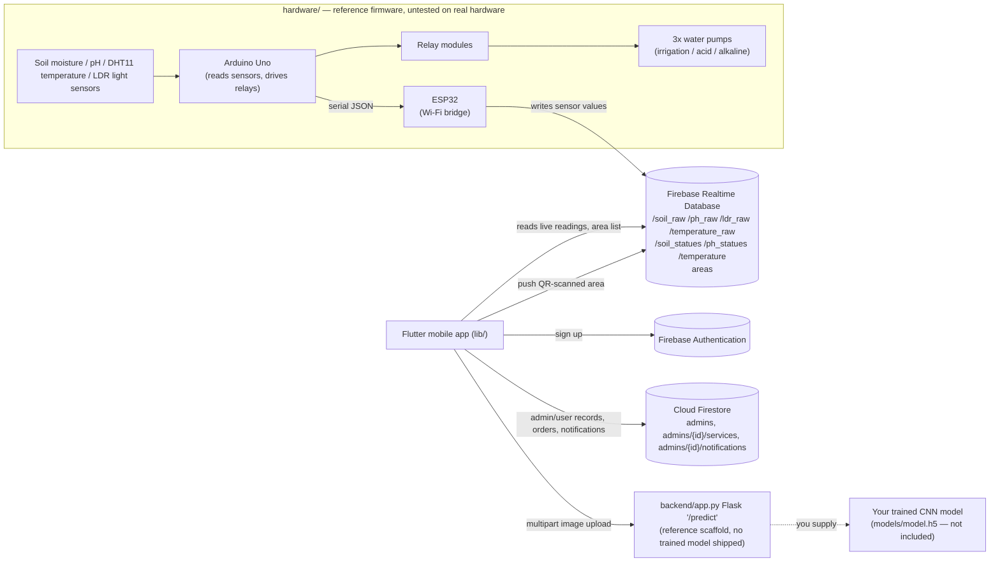

## Hardware Components (documented)

The following hardware is described in the project's thesis documentation. It is listed here for completeness; **no firmware or wiring source code is included in this repository.**

| Component | Purpose |
|---|---|
| Arduino Uno | Central microcontroller — reads sensors, runs threshold logic, drives relays |
| ESP32 | Wi-Fi bridge between Arduino and Firebase; relays sensor data and receives app commands |
| Soil Moisture Sensor | Measures volumetric soil water content |
| pH Sensor | Measures soil acidity/alkalinity |
| DHT11 | Ambient temperature sensor |
| LDR (Light Dependent Resistor) | Measures light intensity |
| Water Pumps (×3) | Irrigation, acid-solution delivery, nutrient-solution delivery |
| Relay Modules (×3) | Electrically isolate Arduino outputs from pump circuits |
| Water Sprayer | Humidity/cooling mist |
| Rechargeable Battery (12V) | Backup power |
| Water/Acid/Nutrient Tanks | Fluid reservoirs feeding the pumps |
| Greenhouse frame (wood/glass/mirrors) | Prototype enclosure |

## Software Technologies

Confirmed from `pubspec.yaml` and source code:

- **Flutter / Dart** — cross-platform mobile app
- **Firebase Core, Auth, Cloud Firestore, Realtime Database** — backend
- **provider** — app state management (`CartProvider`, `AdminProvider`)
- **mobile_scanner** — QR code scanning
- **image_picker** — leaf photo capture/selection
- **http** — multipart upload to the disease-diagnosis endpoint
- **flutter_localizations** + ARB files — English/Arabic localization
- **shared_preferences** — persisting the selected locale

Reference implementations added alongside the app (see their own READMEs for setup and honest caveats):
- **Python, Flask, TensorFlow/Keras, Pillow** — `backend/app.py`, a disease-diagnosis server matching the app's request/response contract exactly. Ships with no trained model, class list, or treatment text — you must supply your own.
- **Arduino IDE (C/C++), ArduinoJson, Adafruit DHT, Firebase ESP Client** — `hardware/arduino_uno/arduino_uno.ino` and `hardware/esp32_gateway/esp32_gateway.ino`, matching the exact Firebase paths the app reads. Untested on real hardware.

## Project Structure

```text
lib/
├── main.dart                     # App entry point, Firebase init, MultiProvider, locale setup
├── firebase_options.dart         # FlutterFire-generated config (gitignored — see Configuration)
├── admin_provider.dart           # ChangeNotifier holding the signed-in admin/user id
├── cart_provider.dart            # ChangeNotifier for marketplace cart state
├── localization_service.dart
├── Pages/
│   ├── AreaListScreenAdmin.dart
│   ├── AreaListScreenUser.dart
│   ├── notifications.dart        # Live Firestore-backed notifications feed
│   ├── qr_scan_screen.dart       # QR scan -> Realtime Database 'areas' node
│   ├── scan_page.dart            # Leaf image capture -> POST to /predict
│   ├── user_planet_screen.dart
│   ├── auth_pages/                # Login, registration, password reset, role selection
│   ├── main_pages/                 # Home/dashboard, admin home & settings, browse, profile, services entry, reference
│   ├── sensors_pages/              # pH / soil moisture / combined sensor dashboards
│   └── services_pages/             # Seeds, tools, machines, farmer hiring, cart
├── helper/
│   ├── dimintions.dart            # Responsive sizing helpers
│   └── notification_service.dart  # Writes alerts/bookings to Firestore notifications
├── widget/                        # ~18 shared UI components
└── l10n/
    ├── app_en.arb
    └── app_ar.arb

assets/
├── images/                        # UI illustrations/icons
├── screenShots/                   # App screenshots used in this README
└── fonts/                         # K2D font family

hardware/                          # Reference Arduino/ESP32 firmware (untested) — see hardware/README.md
backend/                           # Reference Flask disease-diagnosis server (no model included) — see backend/README.md
```

## Installation

Prerequisites: [Flutter SDK](https://docs.flutter.dev/get-started/install) (`^3.5.0` per `pubspec.yaml`'s Dart SDK constraint), a Firebase project, and the [FlutterFire CLI](https://firebase.flutter.dev/docs/cli/) if you plan to regenerate Firebase config.

```bash
git clone <this-repo-url>
cd <repo-folder>
flutter pub get
```

## Configuration

This repository does **not** include the original developer's live Firebase credentials — they are gitignored. To run the app you need your own Firebase project:

1. Create a Firebase project (enable **Authentication** with Email/Password, **Cloud Firestore**, and **Realtime Database**).
2. Install the FlutterFire CLI and run `flutterfire configure` from the project root — this generates `lib/firebase_options.dart` for your project. A template with the expected shape is provided at [`lib/firebase_options.example.dart`](lib/firebase_options.example.dart).
3. For Android, this also downloads `android/app/google-services.json` for you. A template of its expected structure is at [`android/app/google-services.example.json`](android/app/google-services.example.json).
4. Update the Realtime Database with matching node names if you want the sensor dashboard to show live data: `/soil_raw`, `/ph_raw`, `/ldr_raw`, `/temperature_raw`, `/soil_statues`, `/ph_statues`, `/temperature`.
5. If you stand up your own disease-diagnosis server, update the hardcoded endpoint in [`lib/Pages/scan_page.dart`](lib/Pages/scan_page.dart) (currently a placeholder LAN address) to point at your server's `/predict` route.
6. **Security note:** the current sign-in flow queries the Firestore `admins` collection and compares plaintext password fields client-side, rather than using `FirebaseAuth.signInWithEmailAndPassword`. If you intend to run this beyond a local demo, this should be replaced with proper Firebase Authentication sign-in and your Firestore/Realtime Database security rules should be reviewed — neither is configured by this repository.

## Running the Project

```bash
flutter run
```

The disease-diagnosis feature additionally requires a running server implementing the `/predict` endpoint — see [`backend/README.md`](backend/README.md) to run the included reference Flask server (you'll need to supply your own trained model). The hardware-driven sensor readings require the firmware in [`hardware/`](hardware/README.md) flashed to real Arduino/ESP32 boards; without it, the sensor dashboard will simply show a loading spinner (no data at those Realtime Database paths).

## AI / Disease Detection

From `lib/Pages/scan_page.dart`: the user captures or picks a leaf photo, which is sent as a multipart HTTP POST to a `/predict` endpoint. The app expects a JSON response containing a `status` field and, optionally, a `cure` recommendation and a base64-encoded image.

A reference server implementing this exact contract is included at [`backend/app.py`](backend/app.py) — see [`backend/README.md`](backend/README.md). It ships with **no trained model, class list, or treatment data**: the thesis documentation describes a custom CNN trained with TensorFlow/Keras, while this repository's prior README instead described a YOLOv5-based pipeline with weights hosted on Google Drive. These two descriptions conflict and neither's actual training code or dataset was available, so the scaffold assumes the CNN/Keras architecture and requires you to supply a real model file — no accuracy figures are claimed anywhere.

## Firebase Usage

Exact paths/collections found in the source (no others are used):

**Realtime Database**
- `areas` — new zones registered via QR scan (`name`, `mac`, `added_at`)
- `/soil_raw`, `/ph_raw`, `/ldr_raw`, `/temperature_raw` — live sensor readings
- `/soil_statues`, `/ph_statues`, `/temperature` — status/threshold values written from the admin "add area" screen

**Cloud Firestore**
- `admins` — admin and user account records (including the password fields used at sign-in)
- `admins/{adminId}/services/order_{timestamp}` — marketplace orders submitted from the cart
- `admins/{adminId}/notifications` — live notification feed (booking confirmations from checkout; low-moisture/pH/light alerts from the sensor dashboard), read by `notifications.dart`, written by `lib/helper/notification_service.dart`

**Firebase Authentication**
- Used for new user registration (`createUserWithEmailAndPassword`); not currently used for sign-in (see security note above).

No Firebase Storage usage was found in the codebase.

## Testing

`test/widget_test.dart` is the default Flutter counter-app smoke test, adjusted only enough to compile against this project's `main.dart`. It does not test any of this app's actual screens or logic, and would fail if run as-is since the app has no counter UI. There is no automated test coverage for authentication, sensors, QR handling, or Firebase integration at this time.

## Documentation vs. Implementation Notes

A few points worth knowing before relying on the thesis documentation as a description of this codebase:

- **Disease detection backend**: the thesis describes a Flask + CNN (TensorFlow/Keras) service; this repo's previous README described Python + YOLOv5 instead. A reference Flask server matching the app's exact contract is now included at `backend/`, but it ships with **no trained model** — you must supply one, so the real model architecture and accuracy remain unverified either way.
- **Arduino/ESP32 firmware**: fully described in the documentation. Reference firmware matching the app's exact Firebase paths is now included at `hardware/`, but it has **not been tested on real hardware** — no board/sensors were available to verify it against.
- **Notifications**: now backed by real Firestore data (booking confirmations and sensor threshold alerts) instead of the original static mockup. Still in-app only — no push notifications when the app is closed, since that would require `firebase_messaging`, platform push setup, and a server-side trigger, none of which are in scope here.
- **QR area registration**: now fully wired — the admin/user area lists read the same Realtime Database `areas` node that the QR scan writes to, instead of a hardcoded stub list.
- **Sensor dashboard temperature display**: fixed a pre-existing display bug where the raw Celsius value from `/temperature_raw` was divided by 100 and shown as a misleading "25%"; it now shows the actual `°C` reading on a 0-50°C gauge.
- **Admin/user authentication**: not detailed in the documentation; implemented via a single Firestore `admins` collection with separate plaintext password fields per role, checked client-side rather than through Firebase Authentication sign-in. **Left as-is** (not changed in this pass) — fixing it properly would require migrating to real Firebase Auth sign-in and would break any accounts already created under the old scheme.

## Screenshots

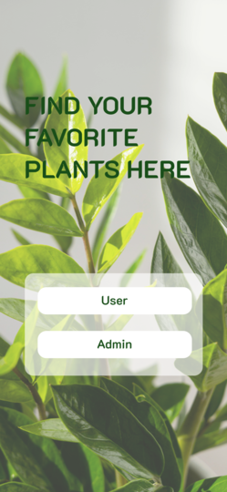

<details>
<summary>More screenshots</summary>

**Authentication**

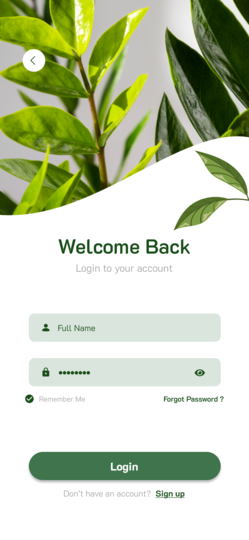
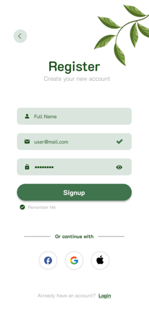
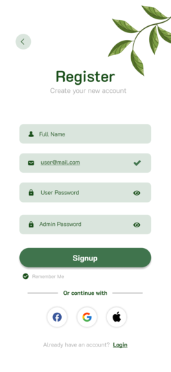
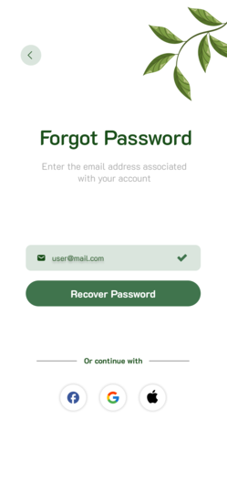
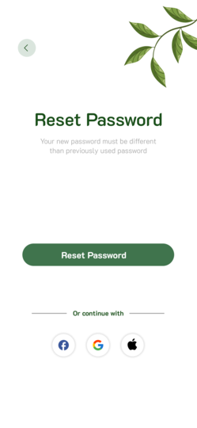

**Navigation & Info**

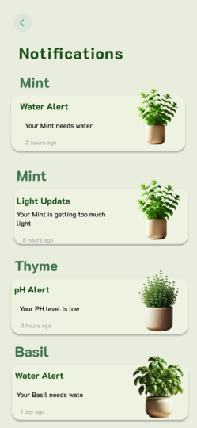
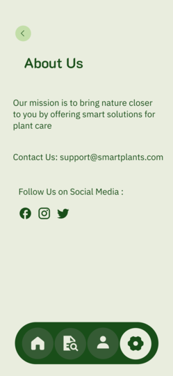

**Plant Management**

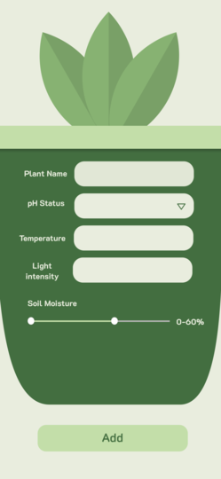
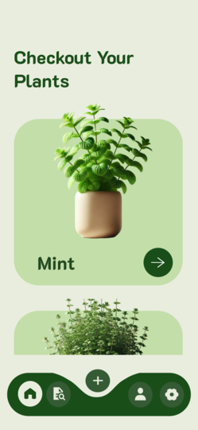

**Browse & Reference**

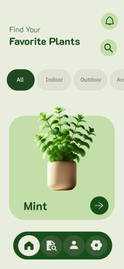
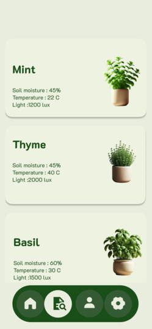

**Settings & Profile**

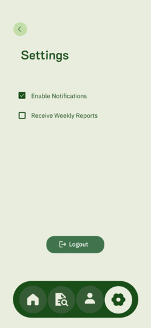
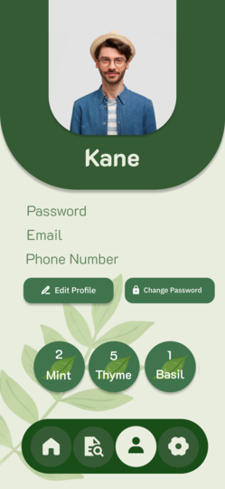

**Scanning & Sensors**

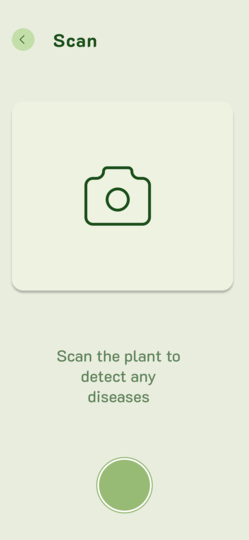
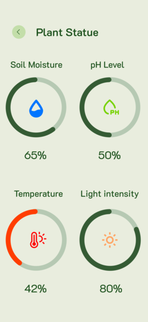

**User's Planet**

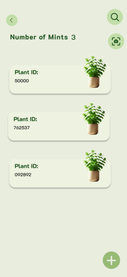

</details>

## Future Improvements

From the project's documented roadmap (not yet implemented):

- 360° camera surveillance with automatic disease-symptom photo capture
- Weather-responsive automated shade/rain canopy deployment
- Solar-powered operation for off-grid deployment
- Multi-sensor data fusion and auto-calibration
- Farm-scale, multi-zone centralized dashboard
- Commission-based revenue model for the services marketplace
- Modular hardware upgrades (CO₂/nutrient sensors, wireless nodes)

## Contributors

Developed by a graduation project team at the Faculty of Computer Science & Artificial Intelligence, Pharos University in Alexandria (2025), under academic supervision.

## License

This project is licensed under the [MIT License](LICENSE) — a permissive license well suited to a portfolio/academic project, allowing others to learn from, reuse, and build on the code with attribution and minimal restriction. Bundled assets (e.g., the K2D font family in `assets/fonts/`) remain subject to their own original licenses.
