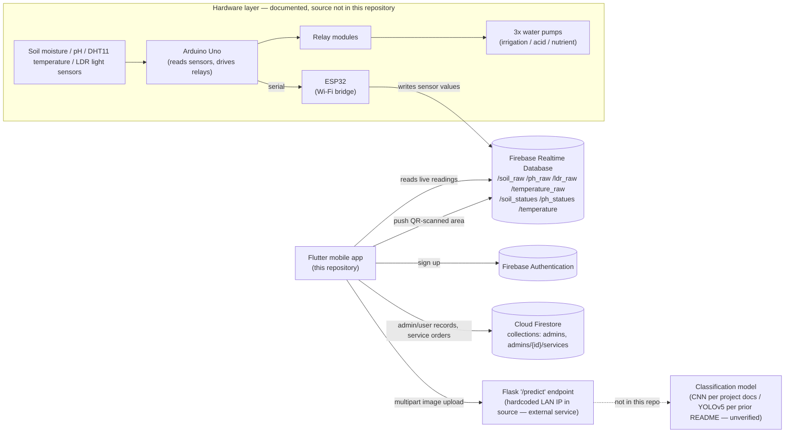

# BloomTech — Smart Agriculture Nursery Management

> "From a single pot to a full field — BloomTech grows with you."

A Flutter mobile application for automated plant nursery management, developed as a graduation project for the Faculty of Computer Science & Artificial Intelligence, Pharos University in Alexandria (2025). The app provides a real-time interface to a sensor-driven monitoring/irrigation system, an AI-assisted leaf disease scanning workflow, and an in-app agricultural services marketplace.

**Scope note:** This repository contains the **Flutter mobile application**. The project as documented also involves an Arduino/ESP32-based hardware controller and a Flask-based image classification server; neither's source code is included in this repository (see [Architecture](#system-architecture) and [Documentation vs. Implementation Notes](#documentation-vs-implementation-notes) below for exactly what is and isn't verified here).

---

## Table of Contents

- [Overview](#overview)
- [Problem Statement](#problem-statement)
- [Objectives](#objectives)
- [Key Features](#key-features)
- [System Architecture](#system-architecture)
- [Hardware Components](#hardware-components-documented)
- [Software Technologies](#software-technologies)
- [Project Structure](#project-structure)
- [Installation](#installation)
- [Configuration](#configuration)
- [Running the Project](#running-the-project)
- [AI / Disease Detection](#ai--disease-detection)
- [Firebase Usage](#firebase-usage)
- [Testing](#testing)
- [Documentation vs. Implementation Notes](#documentation-vs-implementation-notes)
- [Screenshots](#screenshots)
- [Future Improvements](#future-improvements)
- [Contributors](#contributors)
- [License](#license)

---

## Overview

Traditional nursery management relies on manual monitoring, which is slow to react to changing soil, light, and moisture conditions and inconsistent at spotting early plant disease. BloomTech pairs a Firebase-backed mobile app with an IoT sensor/actuator system to give nursery owners live environmental data, automated irrigation and pH correction, and a camera-based disease-scanning workflow, alongside a built-in marketplace for renting tools, hiring farmers, and buying seeds.

## Problem Statement

Many plant nurseries lack real-time, integrated monitoring and automated response to environmental changes. Manual observation delays the detection of poor soil moisture, pH imbalance, and disease outbreaks, leading to avoidable crop loss. BloomTech addresses this by combining continuous sensor monitoring, automated corrective actuation, and image-based disease screening in a single mobile-first system.

## Objectives

- Continuously monitor soil moisture, pH, temperature, and light intensity per registered growing area.
- Automatically trigger irrigation and pH-correction pumps when readings cross defined thresholds.
- Let users add new sensor-monitored zones by scanning a QR code.
- Offer AI-assisted plant leaf disease screening from a captured/selected photo.
- Provide a lightweight in-app marketplace for seeds, tool/machine rental, and hiring farm labor.
- Support both English and Arabic users.

## Key Features

| Feature | Status |
|---|---|
| Real-time sensor dashboard (soil moisture, pH, temperature, light) via Firebase Realtime Database | ✅ Implemented |
| User authentication (sign up) via Firebase Authentication | ✅ Implemented |
| Admin/user sign-in via Firestore-stored credentials | ⚠️ Implemented, but see security note below |
| QR-code scanning to register a new area (writes to Realtime Database) | ⚠️ Partially implemented — the scan-and-write path works; the admin area list currently reads from a hardcoded list rather than the live data |
| Leaf image capture and upload to an external diagnosis endpoint | ✅ Implemented (client side only — see [AI / Disease Detection](#ai--disease-detection)) |
| Agricultural services marketplace (seeds, tools, machines, farmer hiring, cart, order submission to Firestore) | ✅ Implemented |
| Admin panel (admin registration, admin home/settings) | ✅ Implemented |
| Notifications screen | ❌ UI mockup only — static hardcoded cards, no live data or push notifications |
| English/Arabic localization | ✅ Implemented |
| Automated irrigation / pH correction hardware (Arduino + ESP32 + relays + pumps) | 📄 Documented but implementation not verified — no firmware source in this repository |
| CNN/YOLOv5-based disease classification model | 📄 Documented but implementation not verified — no model or server source in this repository |

## System Architecture

The diagram below reflects only what is confirmed either in the Flutter source code or by the project documentation, with external/undocumented-in-repo components labeled accordingly.



## Hardware Components (documented)

The following hardware is described in the project's thesis documentation. It is listed here for completeness; **no firmware or wiring source code is included in this repository.**

| Component | Purpose |
|---|---|
| Arduino Uno | Central microcontroller — reads sensors, runs threshold logic, drives relays |
| ESP32 | Wi-Fi bridge between Arduino and Firebase; relays sensor data and receives app commands |
| Soil Moisture Sensor | Measures volumetric soil water content |
| pH Sensor | Measures soil acidity/alkalinity |
| DHT11 | Ambient temperature sensor |
| LDR (Light Dependent Resistor) | Measures light intensity |
| Water Pumps (×3) | Irrigation, acid-solution delivery, nutrient-solution delivery |
| Relay Modules (×3) | Electrically isolate Arduino outputs from pump circuits |
| Water Sprayer | Humidity/cooling mist |
| Rechargeable Battery (12V) | Backup power |
| Water/Acid/Nutrient Tanks | Fluid reservoirs feeding the pumps |
| Greenhouse frame (wood/glass/mirrors) | Prototype enclosure |

## Software Technologies

Confirmed from `pubspec.yaml` and source code:

- **Flutter / Dart** — cross-platform mobile app
- **Firebase Core, Auth, Cloud Firestore, Realtime Database** — backend
- **provider** — app state management (`CartProvider`, `AdminProvider`)
- **mobile_scanner** — QR code scanning
- **image_picker** — leaf photo capture/selection
- **http** — multipart upload to the disease-diagnosis endpoint
- **flutter_localizations** + ARB files — English/Arabic localization
- **shared_preferences** — persisting the selected locale

Referenced by project documentation / the prior README but **not present as source in this repository**:
- Python, Flask (the disease-diagnosis server the app talks to)
- TensorFlow/Keras CNN (per thesis) or YOLOv5 (per the repository's previous README) — the two documents disagree on the model architecture, and neither's training/serving code is included here
- Arduino IDE / C++ firmware for the Arduino Uno and ESP32

## Project Structure

```text
lib/
├── main.dart                     # App entry point, Firebase init, MultiProvider, locale setup
├── firebase_options.dart         # FlutterFire-generated config (gitignored — see Configuration)
├── admin_provider.dart           # ChangeNotifier holding the signed-in admin/user id
├── cart_provider.dart            # ChangeNotifier for marketplace cart state
├── localization_service.dart
├── Pages/
│   ├── AreaListScreenAdmin.dart
│   ├── AreaListScreenUser.dart
│   ├── notifications.dart        # Static UI mockup (see Key Features)
│   ├── qr_scan_screen.dart       # QR scan -> Realtime Database 'areas' node
│   ├── scan_page.dart            # Leaf image capture -> POST to /predict
│   ├── user_planet_screen.dart
│   ├── auth_pages/                # Login, registration, password reset, role selection
│   ├── main_pages/                 # Home/dashboard, admin home & settings, browse, profile, services entry, reference
│   ├── sensors_pages/              # pH / soil moisture / combined sensor dashboards
│   └── services_pages/             # Seeds, tools, machines, farmer hiring, cart
├── helper/
│   └── dimintions.dart            # Responsive sizing helpers
├── widget/                        # ~18 shared UI components
└── l10n/
    ├── app_en.arb
    └── app_ar.arb

assets/
├── images/                        # UI illustrations/icons
├── screenShots/                   # App screenshots used in this README
└── fonts/                         # K2D font family
```

## Installation

Prerequisites: [Flutter SDK](https://docs.flutter.dev/get-started/install) (`^3.5.0` per `pubspec.yaml`'s Dart SDK constraint), a Firebase project, and the [FlutterFire CLI](https://firebase.flutter.dev/docs/cli/) if you plan to regenerate Firebase config.

```bash
git clone <this-repo-url>
cd <repo-folder>
flutter pub get
```

## Configuration

This repository does **not** include the original developer's live Firebase credentials — they are gitignored. To run the app you need your own Firebase project:

1. Create a Firebase project (enable **Authentication** with Email/Password, **Cloud Firestore**, and **Realtime Database**).
2. Install the FlutterFire CLI and run `flutterfire configure` from the project root — this generates `lib/firebase_options.dart` for your project. A template with the expected shape is provided at [`lib/firebase_options.example.dart`](lib/firebase_options.example.dart).
3. For Android, this also downloads `android/app/google-services.json` for you. A template of its expected structure is at [`android/app/google-services.example.json`](android/app/google-services.example.json).
4. Update the Realtime Database with matching node names if you want the sensor dashboard to show live data: `/soil_raw`, `/ph_raw`, `/ldr_raw`, `/temperature_raw`, `/soil_statues`, `/ph_statues`, `/temperature`.
5. If you stand up your own disease-diagnosis server, update the hardcoded endpoint in [`lib/Pages/scan_page.dart`](lib/Pages/scan_page.dart) (currently a placeholder LAN address) to point at your server's `/predict` route.
6. **Security note:** the current sign-in flow queries the Firestore `admins` collection and compares plaintext password fields client-side, rather than using `FirebaseAuth.signInWithEmailAndPassword`. If you intend to run this beyond a local demo, this should be replaced with proper Firebase Authentication sign-in and your Firestore/Realtime Database security rules should be reviewed — neither is configured by this repository.

## Running the Project

```bash
flutter run
```

The disease-diagnosis feature additionally requires a reachable server implementing the `/predict` endpoint the app calls (see [AI / Disease Detection](#ai--disease-detection)); that server's source is not part of this repository.

## AI / Disease Detection

From `lib/Pages/scan_page.dart`: the user captures or picks a leaf photo, which is sent as a multipart HTTP POST to an external `/predict` endpoint. The app expects a JSON response containing a `status` field and, optionally, a `cure` recommendation and a base64-encoded annotated image.

The model/server behind this endpoint is **not included in this repository**. The project's thesis documentation describes a custom Convolutional Neural Network trained with TensorFlow/Keras and served via Flask; this repository's own prior README instead described a YOLOv5-based pipeline with weights hosted on Google Drive. Since neither the training code nor the server is present here, the actual model architecture and any accuracy figures are **not verified** — no accuracy percentage is claimed.

## Firebase Usage

Exact paths/collections found in the source (no others are used):

**Realtime Database**
- `areas` — new zones registered via QR scan (`name`, `mac`, `added_at`)
- `/soil_raw`, `/ph_raw`, `/ldr_raw`, `/temperature_raw` — live sensor readings
- `/soil_statues`, `/ph_statues`, `/temperature` — status/threshold values written from the admin "add area" screen

**Cloud Firestore**
- `admins` — admin and user account records (including the password fields used at sign-in)
- `admins/{adminId}/services/order_{timestamp}` — marketplace orders submitted from the cart

**Firebase Authentication**
- Used for new user registration (`createUserWithEmailAndPassword`); not currently used for sign-in (see security note above).

No Firebase Storage usage was found in the codebase.

## Testing

`test/widget_test.dart` is the default Flutter counter-app smoke test, adjusted only enough to compile against this project's `main.dart`. It does not test any of this app's actual screens or logic, and would fail if run as-is since the app has no counter UI. There is no automated test coverage for authentication, sensors, QR handling, or Firebase integration at this time.

## Documentation vs. Implementation Notes

A few points worth knowing before relying on the thesis documentation as a description of this codebase:

- **Disease detection backend**: the thesis describes a Flask + CNN (TensorFlow/Keras) service; this repo's previous README described Python + YOLOv5 instead. Neither the server nor the model is included here — only the client-side HTTP call.
- **Arduino/ESP32 firmware**: fully described in the documentation, but no `.ino`/C++ source exists in this repository.
- **Notifications**: documented as a real alert/reminder system; implemented in code only as a static UI mockup.
- **QR area registration**: the write path (scan → Realtime Database) works as documented; the corresponding admin read path currently uses a hardcoded list instead of the live data.
- **Admin/user authentication**: not detailed in the documentation; implemented via a single Firestore `admins` collection with separate plaintext password fields per role, checked client-side rather than through Firebase Authentication sign-in.

## Screenshots


<details>
<summary>More screenshots</summary>

**Authentication**


**Navigation & Info**


**Plant Management**


**Browse & Reference**


**Settings & Profile**


**Scanning & Sensors**


**User's Planet**


</details>

## Future Improvements

From the project's documented roadmap (not yet implemented):

- 360° camera surveillance with automatic disease-symptom photo capture
- Weather-responsive automated shade/rain canopy deployment
- Solar-powered operation for off-grid deployment
- Multi-sensor data fusion and auto-calibration
- Farm-scale, multi-zone centralized dashboard
- Commission-based revenue model for the services marketplace
- Modular hardware upgrades (CO₂/nutrient sensors, wireless nodes)

## Contributors

Developed by a graduation project team at the Faculty of Computer Science & Artificial Intelligence, Pharos University in Alexandria (2025), under academic supervision.

## License

This project is licensed under the [MIT License](LICENSE) — a permissive license well suited to a portfolio/academic project, allowing others to learn from, reuse, and build on the code with attribution and minimal restriction. Bundled assets (e.g., the K2D font family in `assets/fonts/`) remain subject to their own original licenses.
